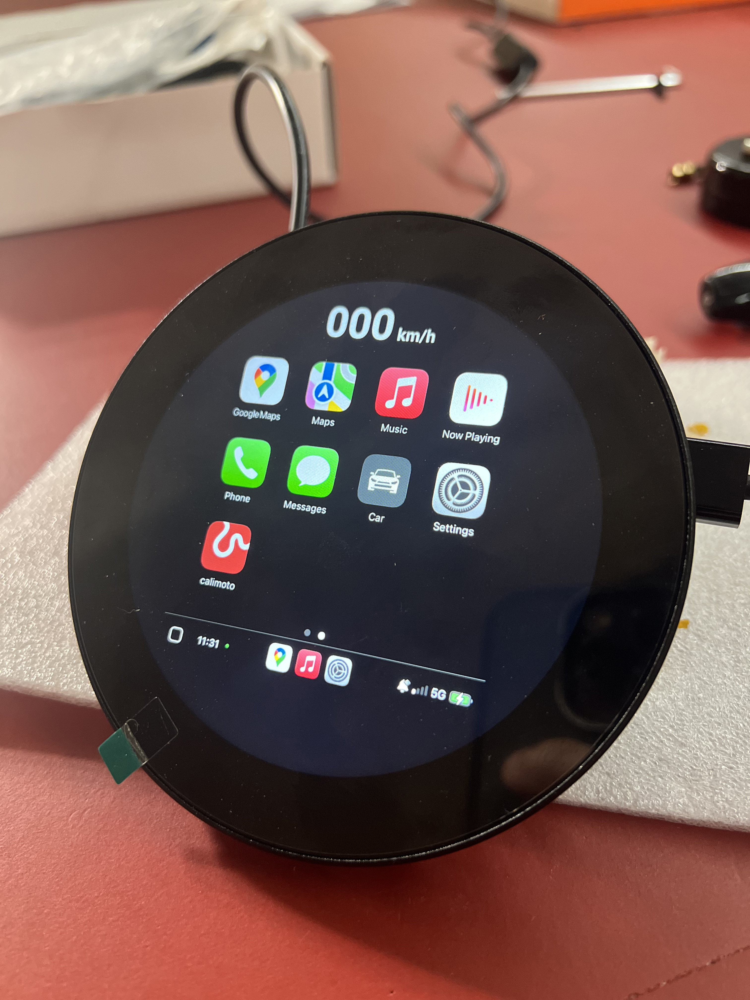

<p align="center">
  <!-- Release -->
  
  <!-- Version -->
  
  <!-- Build Main -->
  
  <!-- Typecheck Main -->
  
  <!-- Build Dev -->
  
  <!-- Typecheck Dev -->
  
  <!-- License -->
  
</p>


# Round Carplay

Round Caraplay is an attempt to adapt the classic Apple CarPlay to a round screen using a Raspberry Pi. The idea is to display CarPlay in a central square area and then fill the surrounding space with information coming from the vehicle’s OBD bus.

Support for Linux (ARM/x86) and macOS (ARM) as well. It is a standalone Electron app, optimized for embedded setups and ultra-low-resolution OEM displays.  

> **Requirements:** A Carlinkit **CPC200-CCPA** (wireless & wired) or **CPC200-CCPW** (wired only) adapter.
## Installation (Raspberry Pi OS)

```bash
curl -LO https://raw.githubusercontent.com/OneMakerShow/round-carplay/main/setup-pi.sh
sudo chmod +x setup-pi.sh
./setup-pi.sh
```

The `setup-pi.sh` script performs the following tasks:

1. check for required tools: curl and xdg-user-dir
2. configures udev rules to ensure the proper access rights for the CarPlay dongle
3. downloads the latest AppImage
4. creates an autostart entry, so the application will launch automatically on boot
5. creates a desktop shortcut for easy access to the application

*Do not run this script on other Linux distributions.*

## Images
<p align="center">
  <strong><span style="font-size:20px;">Reference, Mini Cooper Navigator System</span></strong>
</p>

<p align="center">
  
</p>

<p align="center">
  <strong><span style="font-size:20px;">Real Device First Tests</span></strong>
</p>

<p align="center">
  
  &emsp;&emsp;
  
    &emsp;&emsp;
  
    &emsp;&emsp;
  
</p>


### System Requirements (build)

Make sure the following packages and tools are installed on your system before building:

- **Python 3.x** (for native module builds via `node-gyp`)
- **build-essential** (Linux: includes `gcc`, `g++`, `make`, etc.)
- **libusb-1.0-0-dev** (required for `node-usb`)
- **libudev-dev** (optional but recommended for USB detection on Linux)
- **fuse** (required to run AppImages)

---

### Clone & Build

```bash
git clone --branch main --single-branch https://github.com/OneMakerShow/round-carplay.git \
  && cd pi-carplay \
  && npm run install:clean \
  && npm run build \
  && npm run build:armLinux
```

---

### Linux (x86_64)

This AppImage has been tested on Debian Trixie (13). No additional software is required — just download the x86_64.AppImage and make it executable.

```bash
chmod +x round-carplay-*-x86_64.AppImage
```

---

### Mac (arm64)

This step is required for all non-Apple-signed apps.

```bash
xattr -cr /Applications/round-carplay.app
```

For microphone support, please install Sound eXchange (SoX) via brew.
```bash
brew install sox
```

---

## Links

* **Repository & Issue Tracker:** [OneMakerShow/round-carplay](https://github.com/OneMakerShow/round-carplay)
* **Inspired by:** [pi-carplay](https://github.com/f-io/pi-carplay)

## Disclaimer

** _Apple and CarPlay are trademarks of Apple Inc. This project is not affiliated with or endorsed by Apple in any way. All trademarks are the property of their respective owners._


## License

This project is licensed under the MIT License.
